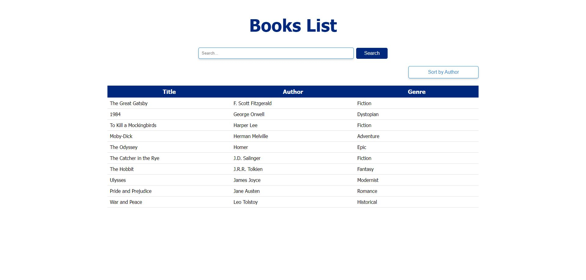

# Books Search

## About

This is a simple books search app built with React, TypeScript, and Sass.

## Features

- Search for books by title, author, or genre
- Sort books by title, author, or genre
- View books in a table format

## Screenshot



## Live Demo

[https://jakimoski.github.io/books-search/](https://jakimoski.github.io/books-search/)

## Tech Stack

- **[ React ](https://react.dev/)**
- **[ Vite ](https://vitejs.dev/)**
- **[ SASS](https://sass-lang.com/)**

## Run Locally

Clone the project

```bash
git clone https://github.com/jakimoski/books-search.git
```

Go to the project directory

```bash
cd my-project
```

Install dependencies

```bash
npm install
```

Start the app locally

```bash
npm run dev
```

Build

```bash
npm run build
```
